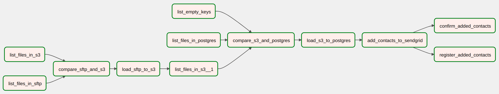

**REP-292 - Add PennyMAc Clicks to Sendgrid**

# Project
## Description
The project goal is to add contacts to an email marketing list in SendGrid.
After the contacts are added, SendGrid will automatically segment the list into contacts segments.
The source of these contacts is HomeStory's SFTP (Secure File Transfer Protocol).


## Dataflow
*SFTP >> S3 >> Postgres >> SendGrid*

Data flow is orchestrated with Airflow and consists of moving/transforming data from SFTP to S3, to Postgres, and finally to SendGrid.
This is enabled by Airflow Connectors and Hooks, and [SendGrid's API](https://docs.sendgrid.com/api-reference/contacts/add-or-update-a-contact).

Configuration constants are stored in: `config.py`
Helper functions are stored in: `/helpers`

Generally, the `dag` calls `tasks` which call `helper functions`.

The complete workflow is represented in the image bellow:


- To synchronize the `.csv` files in SFTP with S3 the following tasks are required:
  - List files from both sources with: `list_files_in_sftp` and `list_files_in_s3`;
  - Compare files with: `compare_sftp_and_s3`;
  - Load files that are not yet present in S3 with: `load_sftp_to_s3`.
- The second synchronization is between S3 and Postgres. The logic is similar, with the additional of the listing of empty files in S3 (among the valid files, PennyMac provides some empty files that should be ignored).
  - Hence, the following tasks list empty files in S3 and valid files already loaded to Postgres: `list_empty_files_in_s3` and `list_files_in_postgres`. Also, a new S3 file list is generated;
  - To compare valid and empty files in S3 and in Postgres the task: `compare_s3_and_postgres`;
  - To load files from S3 to Postgres: `load_s3_to_postgres`.
- To add contacts from Postgres to SendGrid: `add_contacts_to_sendgrid`;
- To keep track of the contacts that were already added to Sendgrid the task: `register_added_contacts`;
- Finally, to make sure the contacts were correctly added, the task: `confirm_added_contacts`. This task waits a few seconds after the previous one and checks if each contact`s email was registered in SendGrid.


# Local Airflow setup

## Airflow installation:
- Official [Airflow docker-compose](https://airflow.apache.org/docs/apache-airflow/stable/howto/docker-compose/index.html).
- Changes required in `docker-compose.yaml`:
  - Change Airflow's version to `2.2.2` (used by HomeStory in 2022-10-12):
    ```
    x-airflow-common:
      ...
      image: ${AIRFLOW_IMAGE_NAME:-apache/airflow:2.2.2}
    ```


## Access dag folder within Airflow:
Map your `dags` folder from the repo to airflows `dags` folder with a symbolic link.
The command I used was: `sudo ln -s ~/Work/Homestory/repo/prefect-flows/dags/rep_292_add_pennymac_clicks/ ~/Work/Homestory/airflow/dags`
Edit the the command according to your specific paths: `sudo ln -s <your_path>/prefect-flows/dags/rep_292_add_pennymac_clicks/ <your_path>/airflow/dags`


## Import Airflow Variables
Run the following command from the folder containing `docker-compose.yaml`:
`docker-compose run --rm airflow-webserver airflow variables import dags/variables/rep_292_sandbox.json`
Replace `airflow-webserver` by the name of docker service (related to airflow webserver) specified in docker-compose.


# Considerations about using airbyte in this project:
Airbyte was not used in this project for the following reasons"
- The Airbyte SFTP source connector failed to specify a schema for a folder with multiple .csv files and some empty ones.
- Currently, there's no SendGrid destination connector.

** Airflow connections configuration**
# Resources creation
The following resources are created with the dag (`dag_create_resources.py`):
- SFTP connection
- Postgres connection
- Postgres tables
- S3 Bucket


# HomeStory SFTP SSH key pair management
- Generate an SSH key pair for Airflow;
- Convert SSH Private Key to PEM `ssh-keygen -p -N "" -m pem -f /path/to/key` in RSA format.
- Supply PUBLIC key to be added to HomeStory SFTP server;
- Store PRIVATE key in AWS Secrets Manager;


Important notes:
- Private key stored in Amazon Secrets Manager, in RSA format (does not accept OpenSHH).
  - `RSA PRIVATE KEY` is supported by Airflow;
  - `OPENSSH PRIVATE KEY` is not supported by Airflow;
  - Private keys stored in Secrets Manager require a particular customization in order to be correctly interpreted by Airflow. End of line characters `/n` must be added before and after the private key per se. This is accomplished with function `fix_private_key()`.
- `no_host_key_check` must be set to `true` when creating SFTP connection

# Input and Output examples
## Example - Input CSV from SFTP
```
"SUBSCRIBERKEY","EMAILADDRESS","MDMID","CLICKDATE","LINKNAME","FIRSTNAME","LASTNAME","PHONENUMBER"
"3******0","joe@gmail.com","1******U","2022-09-21 16:10:00.000","Get Connected","Joe","Doe","NULL"
```
## Example Output - contact to add to SendGrid
`[{"email": "joe@gmail.com", "first_name": "Joe", "last_name": "Doe"}]`
